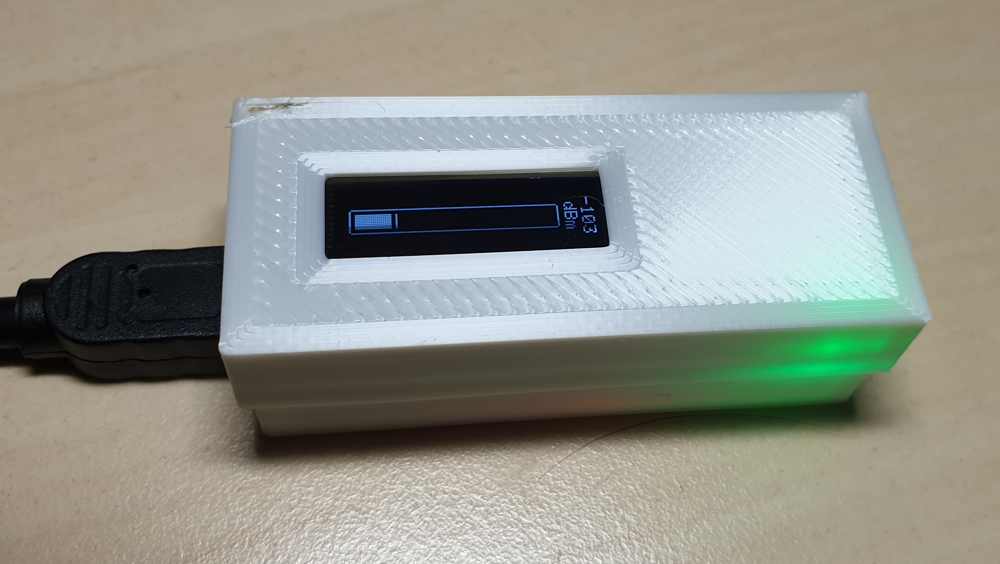
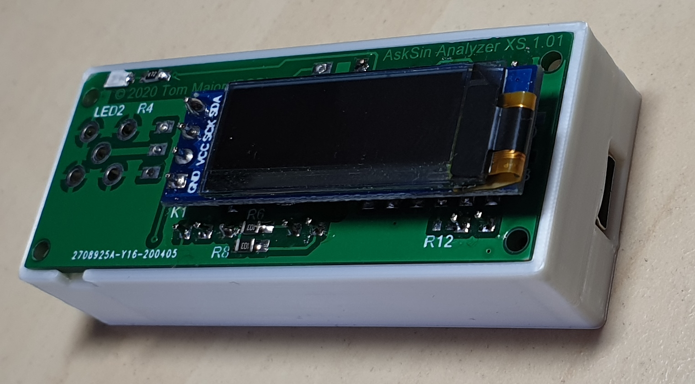
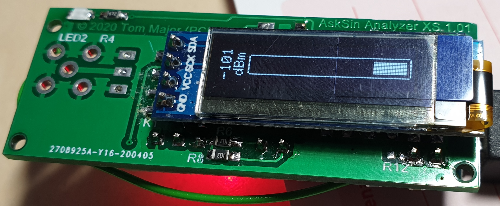
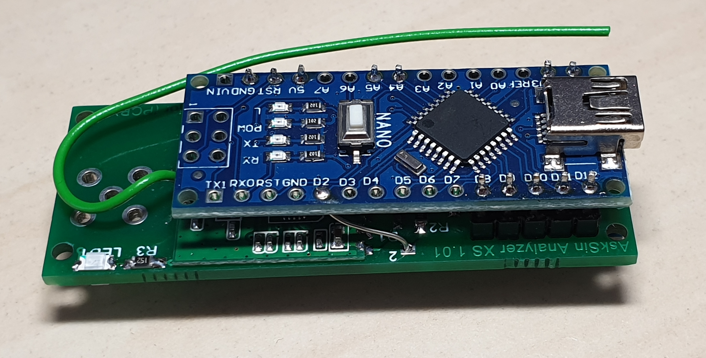
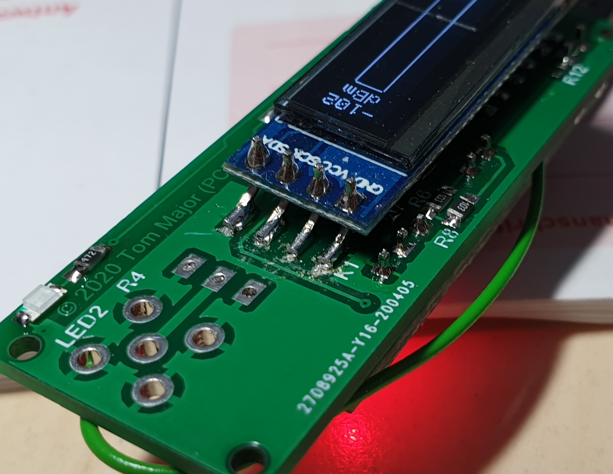
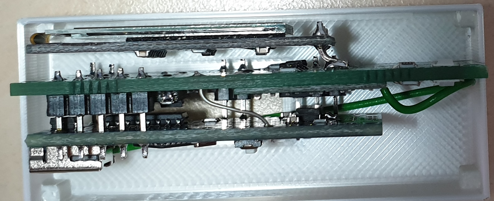

# AskSin Analyzer XS Board - Case

* [Boden](https://github.com/psi-4ward/AskSin-Analyzer-XS-Board-Case/blob/master/stl/Asksin%20XS%20Board%20-%20Boden.stl)
* [Deckel mit Display](https://github.com/psi-4ward/AskSin-Analyzer-XS-Board-Case/blob/master/stl/Asksin%20XS%20Board%20-%20Deckel%20mit%20Display.stl)
* [Fusion 360](https://github.com/psi-4ward/AskSin-Analyzer-XS-Board-Case/raw/master/Asksin%20XS%20Board.f3d)

## Aufbau

Für den Aufbau des Boards hatte ich den Levelshifter **flach** auf der Platine aufliegen lassen.

Der Arduino Nano kommt mit wenig Abstand (ca 1mm) darüber. Auf die Bestückung der `LED1` mit dem Widerstand `R3` kann verzichtet werden, es wird `LED2` und `R4` verwendet.

Für das OLED-Display sind die Stifleisten ohne Abstandshalter "verbogen" und angelötet. Der Abstand zwischen der **Oberseite** der OLED-Platine und dem XS Board sollte 4mm betragen. Beide Platinen sollten bündig abschließen.

## Bilder

## TODO

* Version mit SMD Buchse
* Deckel ohne Display

## Lizenz

**Creative Commons BY-NC-SA** 
Give Credit, NonCommercial, ShareAlike

 This work is licensed under a <a rel="license" href="http://creativecommons.org/licenses/by-nc-sa/4.0/">Creative Commons Attribution-NonCommercial-ShareAlike 4.0 International License</a>.
